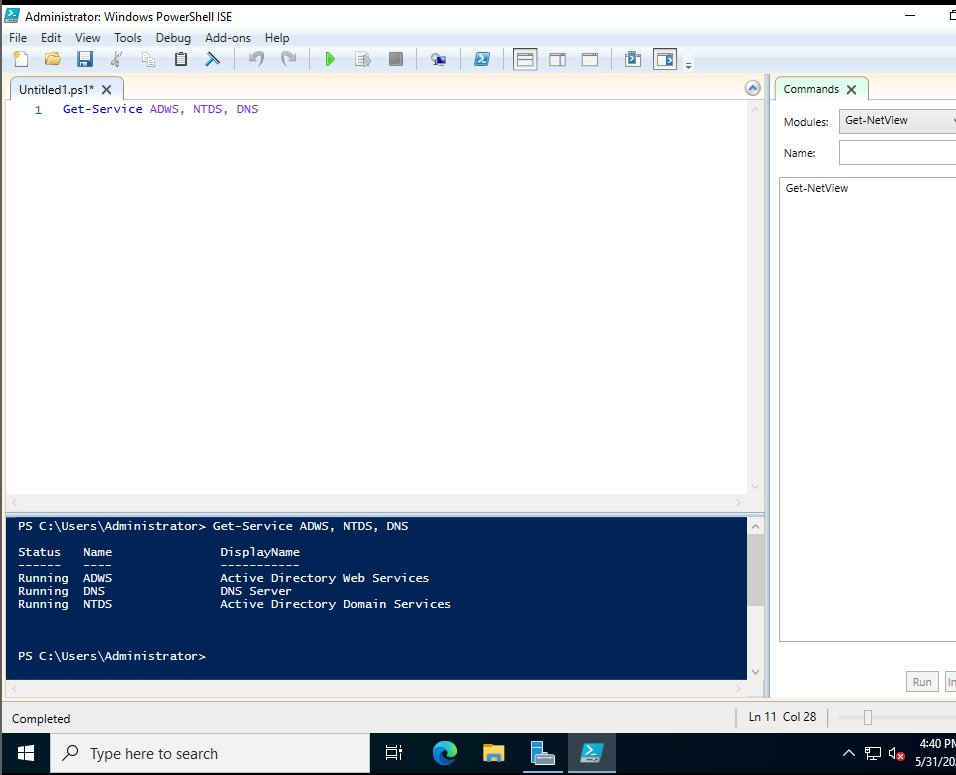
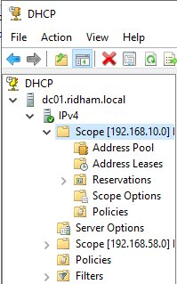
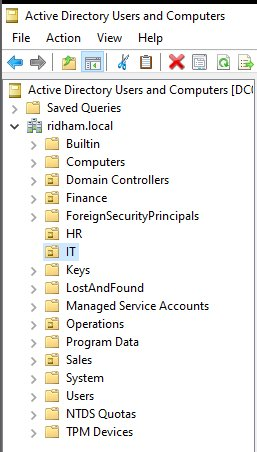
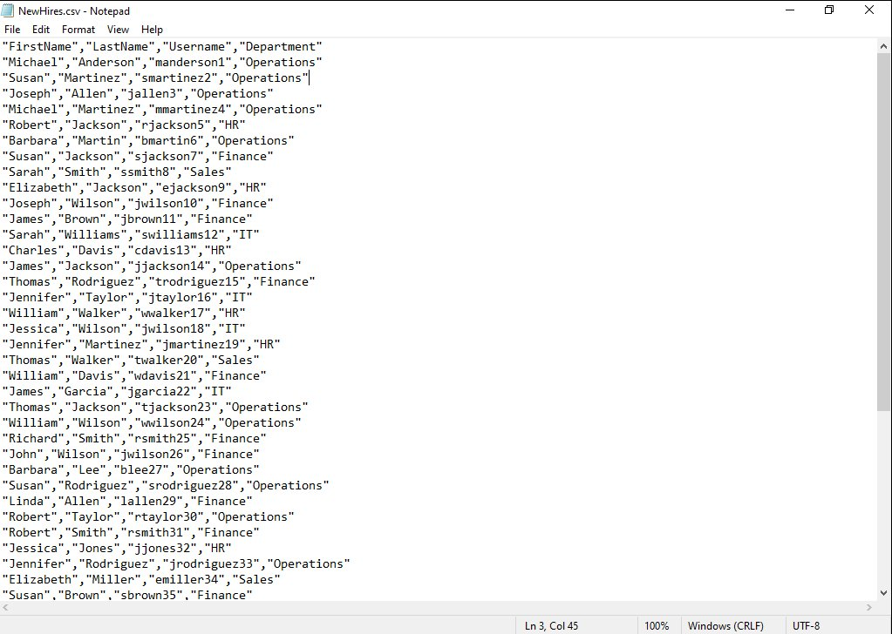
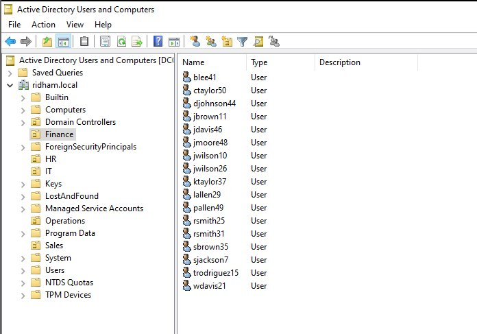
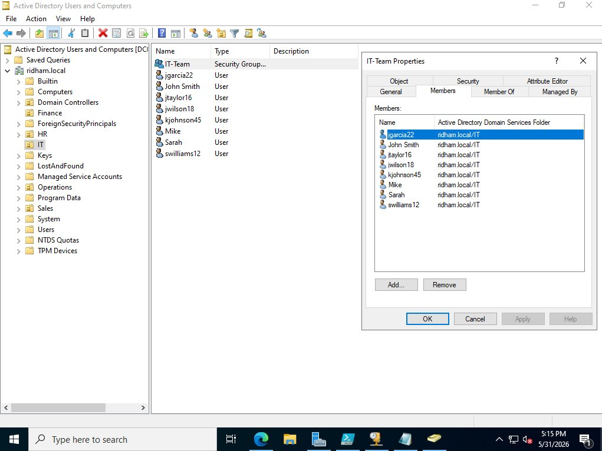
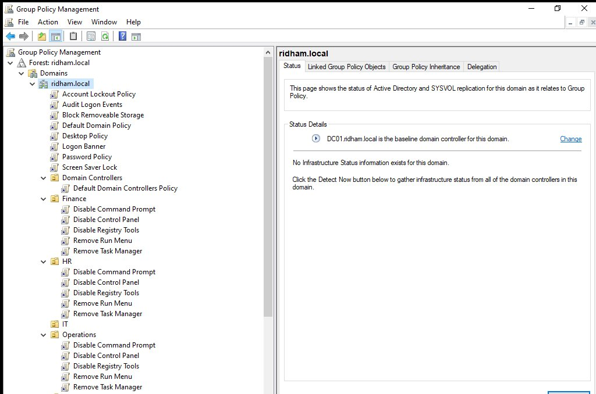
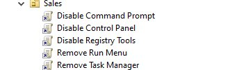
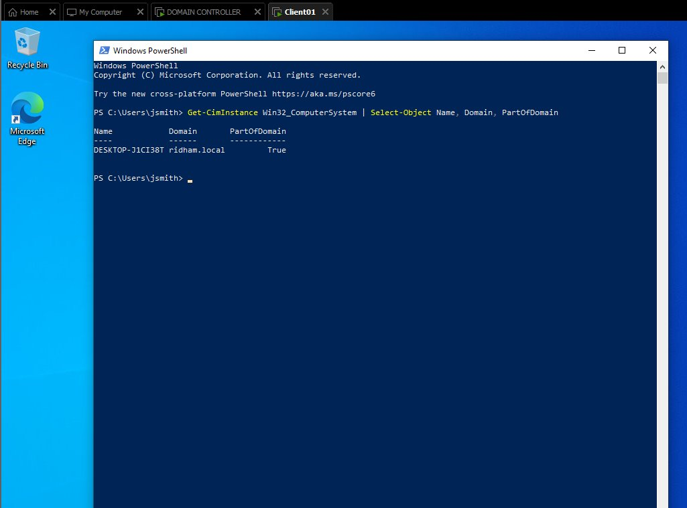
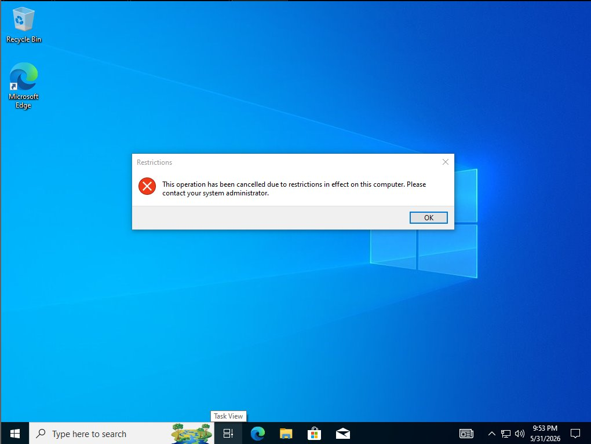

# Active Directory Home Lab

A fully functional Windows Server 2019 Active Directory environment built from scratch in VMware. The lab covers domain services, DNS, DHCP, bulk user provisioning with PowerShell, security groups, and Group Policy, with policy enforcement verified on a domain-joined Windows 10 client.

## Environment

- **Domain Controller:** Windows Server 2019 (`dc01.ridham.local`)
- **Client:** Windows 10 Pro, joined to the domain
- **Domain:** `ridham.local`
- **Virtualization:** VMware

## Skills Demonstrated

Active Directory Domain Services (AD DS), DNS, DHCP, Group Policy (GPO), PowerShell automation, user and access management, security group administration, Windows Server 2019, and client-to-domain integration.

---

## 1. Domain Controller and Core Services

Promoted Windows Server 2019 to a domain controller for `ridham.local` and confirmed the core services (Active Directory Web Services, DNS, and Active Directory Domain Services) were all running.



## 2. DHCP

Installed and authorized the DHCP Server role, then configured a scope to automatically assign IP addresses to machines joining the domain.



## 3. Organizational Units

Created five organizational units modeled on real company departments to organize accounts and apply targeted policies.



## 4. Bulk User Provisioning with PowerShell

Rather than creating accounts by hand, I simulated an HR new-hire list as a CSV and wrote a PowerShell script to provision 50+ users automatically, placing each one into the correct department OU.





## 5. Security Groups

Created per-department security groups and added the matching users, the foundation for role-based access control.



## 6. Group Policy

Built 11 Group Policy Objects. Domain-wide GPOs enforce a password policy, account lockout, a logon banner, logon auditing, and removable storage blocking. A set of user-restriction GPOs (Control Panel, Command Prompt, Registry, Task Manager, and Run menu) are scoped to the standard-user OUs while leaving IT unrestricted.





## 7. Domain-Joined Client

Joined a Windows 10 Pro client to `ridham.local` and confirmed domain membership.



## 8. Policy Enforcement Verified

Logged into the client as a standard domain user and confirmed the Group Policy restriction was enforced, with Control Panel access blocked exactly as configured.



---

## PowerShell Automation

The scripts below handled the repeatable parts of the build.

**Create the organizational units**

```powershell
$domain = (Get-ADDomain).DistinguishedName
$ous = "IT","HR","Finance","Sales","Operations"
foreach ($ou in $ous) {
    New-ADOrganizationalUnit -Name $ou -Path $domain -ProtectedFromAccidentalDeletion $false
}
```

**Generate a new-hire CSV**

```powershell
$firstNames = "James","Mary","John","Patricia","Robert","Jennifer","Michael","Linda","William","Elizabeth","David","Barbara","Richard","Susan","Joseph","Jessica","Thomas","Sarah","Charles","Karen"
$lastNames  = "Smith","Johnson","Williams","Brown","Jones","Garcia","Miller","Davis","Rodriguez","Martinez","Wilson","Anderson","Taylor","Moore","Jackson","Martin","Lee","Walker","Hall","Allen"
$departments = "IT","HR","Finance","Sales","Operations"

$users = @()
for ($i = 1; $i -le 50; $i++) {
    $first = $firstNames | Get-Random
    $last  = $lastNames  | Get-Random
    $users += [PSCustomObject]@{
        FirstName  = $first
        LastName   = $last
        Username   = ($first.Substring(0,1) + $last + $i).ToLower()
        Department = $departments | Get-Random
    }
}
$users | Export-Csv -Path "C:\Lab\NewHires.csv" -NoTypeInformation
```

**Bulk-import the users into their OUs**

```powershell
$people  = Import-Csv -Path "C:\Lab\NewHires.csv"
$domain  = (Get-ADDomain).DistinguishedName
$dnsRoot = (Get-ADDomain).DNSRoot
$password = ConvertTo-SecureString "P@ssw0rd123!" -AsPlainText -Force

foreach ($p in $people) {
    New-ADUser -Name $p.Username -DisplayName "$($p.FirstName) $($p.LastName)" -GivenName $p.FirstName -Surname $p.LastName -SamAccountName $p.Username -UserPrincipalName "$($p.Username)@$dnsRoot" -Path "OU=$($p.Department),$domain" -AccountPassword $password -Enabled $true -ChangePasswordAtLogon $true
}
```

**Create security groups and add members**

```powershell
$domain = (Get-ADDomain).DistinguishedName
foreach ($dept in "IT","HR","Finance","Sales","Operations") {
    $ouPath = "OU=$dept,$domain"
    New-ADGroup -Name "$dept-Team" -GroupScope Global -GroupCategory Security -Path $ouPath
    Get-ADUser -Filter * -SearchBase $ouPath | ForEach-Object {
        Add-ADGroupMember -Identity "$dept-Team" -Members $_
    }
}
```

---

## Key Takeaways

This lab gave me hands-on practice standing up and securing a Windows domain end to end, from core infrastructure roles through policy enforcement on a real client. Automating user creation with PowerShell showed me how administrators handle onboarding at scale instead of one account at a time.
